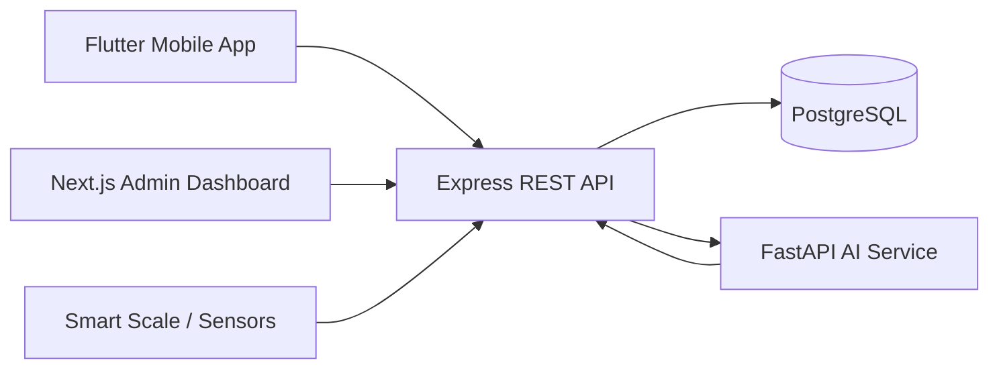

# Architecture

## Components

- Flutter app records meal preparation, distribution, attendance, inventory observations, and quality notes. It stores pending writes in SQLite and syncs when connectivity returns.
- Express API owns authentication, roles, validation, persistence, analytics, reports, and IoT ingestion endpoints.
- PostgreSQL stores schools, users, meals, attendance, nutrition data, inventory, plans, recommendations, and reports.
- FastAPI service performs deterministic nutrition analysis, deficiency detection, and weekly menu planning.
- Next.js dashboard provides district, nutrition officer, and school head views with charts and planning screens.

## Data Flow

1. Kitchen staff enters meal and attendance records on mobile.
2. Offline writes enter the local sync queue.
3. The API validates records and writes them to PostgreSQL.
4. Analytics endpoints aggregate attendance, served meals, nutrition scores, and wastage.
5. AI endpoints enrich menu data with nutrition scores, deficiencies, and weekly plans.
