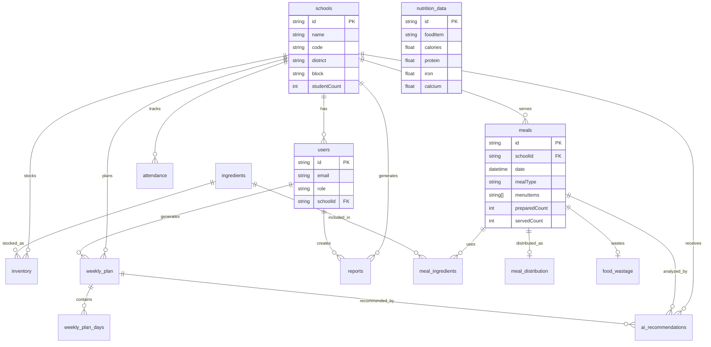

# ER Diagram

```mermaid
erDiagram
  schools ||--o{ users : has
  schools ||--o{ meals : serves
  schools ||--o{ attendance : tracks
  schools ||--o{ inventory : stocks
  schools ||--o{ weekly_plan : plans
  schools ||--o{ ai_recommendations : receives
  schools ||--o{ reports : generates

  meals ||--o{ meal_ingredients : uses
  ingredients ||--o{ meal_ingredients : included_in
  meals ||--o| meal_distribution : distributed_as
  meals ||--o| food_wastage : wastes
  meals ||--o{ ai_recommendations : analyzed_by

  ingredients ||--o{ inventory : stocked_as
  weekly_plan ||--o{ weekly_plan_days : contains
  weekly_plan ||--o{ ai_recommendations : recommended_by
  users ||--o{ reports : creates
  users ||--o{ weekly_plan : generates

  schools {
    string id PK
    string name
    string code
    string district
    string block
    int studentCount
  }

  users {
    string id PK
    string email
    string role
    string schoolId FK
  }

  meals {
    string id PK
    string schoolId FK
    datetime date
    string mealType
    string[] menuItems
    int preparedCount
    int servedCount
  }

  nutrition_data {
    string id PK
    string foodItem
    float calories
    float protein
    float iron
    float calcium
  }
```
